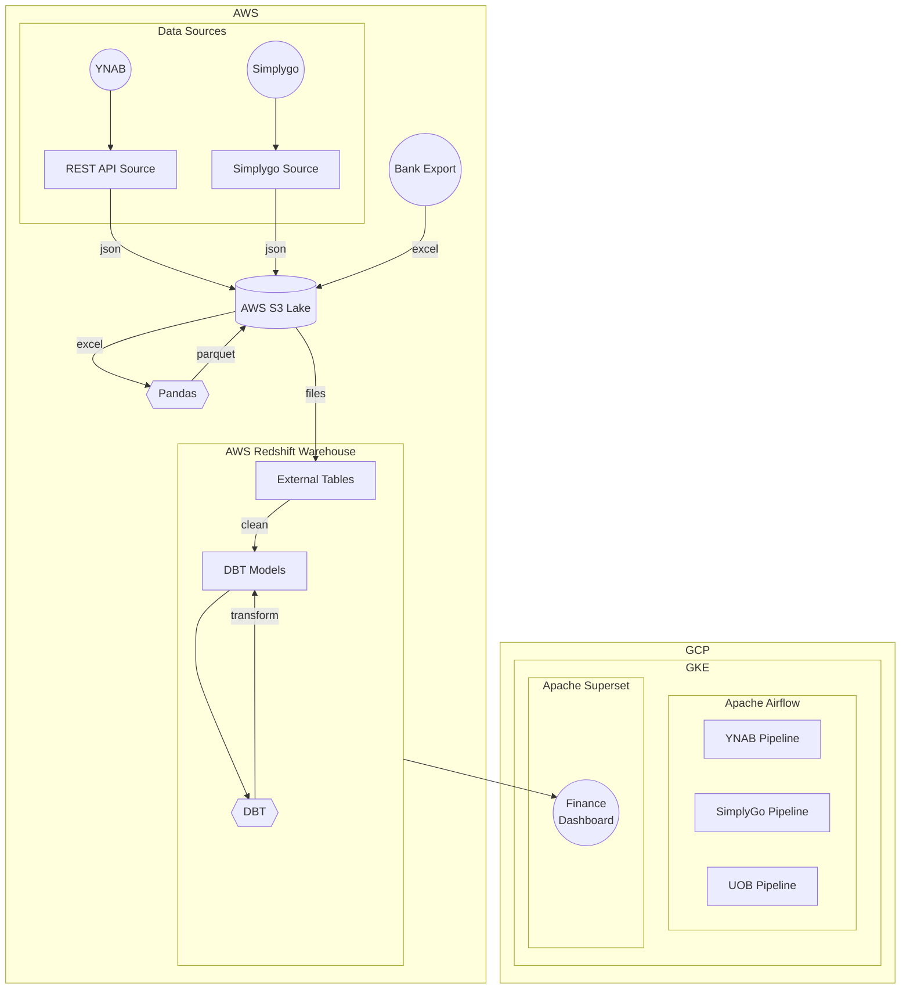
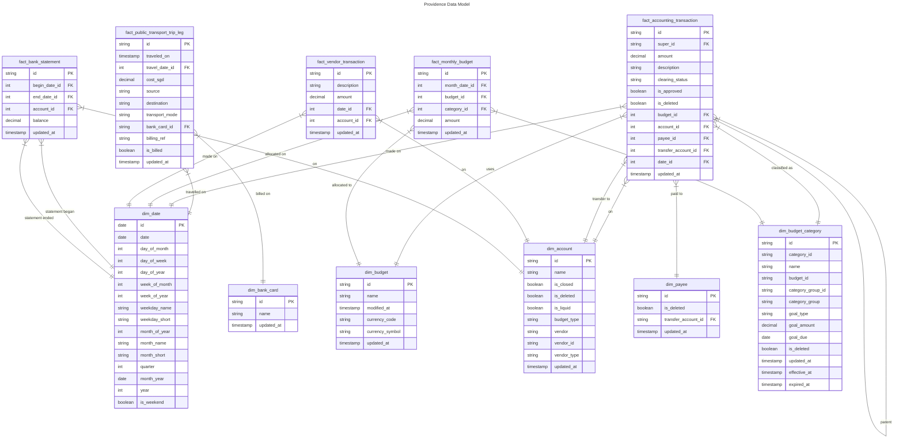

# Providence
Data Pipeline &amp; Dashboard for Personal Finance Monitoring.

## Background
I ❤️  [YNAB](https://www.ynab.com/) for personal finance budgeting/accounting, it really helps me keep my finances in check. However, I hold a few pet peeves with YNAB:
- YNAB's bank account import feature only supports Banks from the US and manual account reconciliation is not a fun experience.
- YNAB's limited visualisation features (bar, pie chart & pivot table) does not give a good picture of "state of finances".
- Keying in a transaction into YNAB every time I can take Public Transport can quickly become repetitive.

## Features
Providence aims to make personal finance less tedious with automation & less opaque with visualisation:
- **Data Sources** to scrape data:
    -  **rest-api-src** pulls Budget/Accounting data from YNAB API.
    -  **simplygo-src** scrapes Public Transport trip data from SimplyGo Portal.
- **Data Transforms** to reshape data:
    - **Pandas** to extract transactions from the Excel export I receive from my Bank.
    - **DBT** to reshape raw data into a Dimensional Model & a Data Mart dedicated for populating the Finance Dashboard.
- **Data Pipelines** Airflow DAGs to orchestrate everything.

![[Finance Dashboard Screenshot.png]]

* **Finance Dashboard** visualise the data to give me a picture of where I'm at financially & assist in me in budgeting / accounting.
    - **Unreconciled Transactions** Lists transactions that in my books but not in my bank account & vice versa. Its a great help when reconciling accounts.

## Architecture

- **Data Lake** AWS S3
- **Data Warehouse** AWS Redshift Serverless
- **Orchestration** Apache Airflow with Kubernetes Executor.
- **Business Intellegence** Apache Superset

## Data Model

See [DBT Docs](https://mrzzy.github.io/providence/#!/overview) for more details.

## License
MIT.
