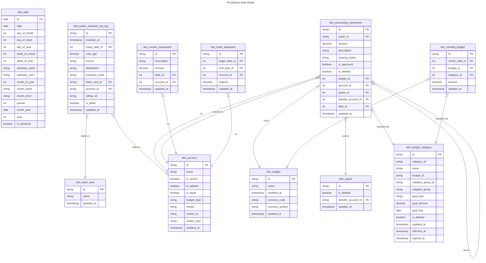

# Providence

Personal Finance Data Pipeline & Dashboard.

## Features

Providence aims to make personal finance less tedious with automation & less opaque with visualisation:

- **Data Sources** to automatically retrieve raw data from data sources:
  - **YNAB Source** pulls Budget/Accounting data from YNAB REST API.
  - **SimplyGo Source** scrapes HTML from [SimplyGo Portal](https://simplygo.transitlink.com.sg/)
- **Data Transforms** to extract tabular data from raw data files:
  - **YNAB transform** extracts accounting transactions from JSON budget data.
  - **SimplyGo transform** extracts public transport trip data from scraped html.
  - **UOB transform** extract bank statement transactions from Excel export.
- **Data Model** DBT Dimensional model integrates data from disparate sources together for analysis.
- **Finance Dashboard** Superset dashboard presets easy to digest metrics on financial health.

## Architecture

V2 architecture redesign focuses on lowering the Total Cost of Ownership (TCO)
by relying on Serverless Compute and free-tier Managed Services:
- **Compute** Azure Container Instances (ACI)
- **Data Lake** Backblaze B2
- **Data Warehouse** MotherDuck DuckDB
- **Orchestration** Prefect
- **Visualisation** Apache Superset

## Data Model

See [DBT Docs](https://mrzzy.github.io/providence/#!/overview) for more details.

## License

MIT.
